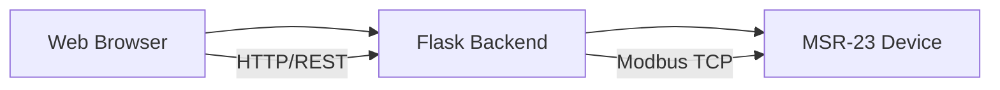

# MSR-23 Web Controller

A web-based interface for controlling the MSR-23 device via Modbus TCP protocol. This application provides a modern web interface to monitor and control various components of the MSR-23 device including Ground Heat Exchanger (GWC), Bypass (BPS), and Heater systems.

## System Architecture

The application follows a three-tier architecture:
1. **Frontend**: React-based web interface
2. **Backend**: Flask-based API server
3. **Device**: MSR-23 Modbus TCP device



## Prerequisites

- Python 3.7 or higher
- Node.js 14 or higher
- npm (Node Package Manager)
- MSR-23 device with network connectivity

## Installation

### Backend Setup

1. Clone the repository and navigate to the project directory
2. Create and activate a Python virtual environment:
   ```bash
   # Create virtual environment
   python -m venv venv

   # Activate virtual environment
   # On Windows:
   venv\Scripts\activate
   # On macOS/Linux:
   source venv/bin/activate
   ```

3. Install Python dependencies:
   ```bash
   pip install -r requirements.txt
   ```

4. Configure the Modbus connection:
   - Open `app.py`
   - Update `MODBUS_HOST` with your device's IP address
   - Update `MODBUS_PORT` if different from default (502)

### Frontend Setup

1. Install Node.js dependencies:
   ```bash
   npm install
   ```

## Running the Application

1. Start the backend server:
   ```bash
   # Make sure your virtual environment is activated
   python app.py
   ```
   The backend will run on `http://localhost:5000`

2. Start the frontend development server:
   ```bash
   npm start
   ```
   The frontend will run on `http://localhost:3000`

## API Endpoints

### Status Endpoint
- **URL**: `/api/status`
- **Method**: `GET`
- **Response**: JSON object containing current status of all components
  ```json
  {
    "gwc_mode": 0,
    "bps_mode": 0,
    "heat_mode": 0
  }
  ```

### Control Endpoint
- **URL**: `/api/control/<component>`
- **Method**: `POST`
- **Parameters**:
  - `component`: One of `gwc`, `bps`, or `heat`
- **Request Body**:
  ```json
  {
    "mode": "string"
  }
  ```
- **Valid Modes**:
  - GWC: `off`, `on`, `auto`, `auto_r`
  - BPS: `off`, `on`, `auto`
  - Heater: `off`, `he`, `hw`, `hc`

## Component Details

### Ground Heat Exchanger (GWC)
- **Register Address**: 4
- **Modes**:
  - OFF (0)
  - ON (1)
  - AUTO (2)
  - AUTO_R (3)

### Bypass System (BPS)
- **Register Address**: 12
- **Modes**:
  - OFF (0)
  - ON (1)
  - AUTO (2)

### Heater
- **Register Address**: 17
- **Modes**:
  - OFF (0)
  - HE (1)
  - HW (2)
  - HC (3)

## Modbus Communication

The application uses Modbus TCP protocol for device communication:
- Default Port: 502
- Function Codes:
  - 03: Read Holding Registers
  - 06: Write Single Register
  - 16: Write Multiple Registers

## Troubleshooting

1. **Connection Issues**:
   - Verify device IP address in `app.py`
   - Ensure device is powered on and connected to network
   - Check if port 502 is accessible

2. **Frontend Not Loading**:
   - Verify Node.js and npm are installed
   - Check for console errors in browser
   - Ensure all dependencies are installed

3. **Backend Errors**:
   - Check Python virtual environment is activated
   - Verify all requirements are installed
   - Check Flask server logs for errors

## Security Considerations

1. **Network Security**:
   - The application should run in a secure network
   - Modbus TCP has no built-in security
   - Consider implementing VPN for remote access

2. **Access Control**:
   - Currently no authentication implemented
   - Consider adding user authentication for production
   - Implement IP whitelisting if needed

## Future Enhancements

1. User Authentication
2. Operation Logging
3. Temperature Monitoring
4. Historical Data Visualization
5. Email/SMS Alerts
6. Mobile-Responsive Design

## Contributing

1. Fork the repository
2. Create a feature branch
3. Commit your changes
4. Push to the branch
5. Create a Pull Request

## License

This project is licensed under the MIT License - see the LICENSE file for details. 